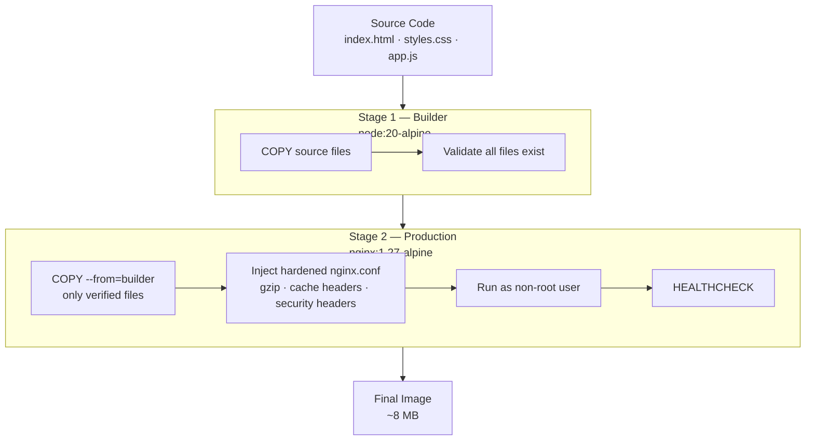
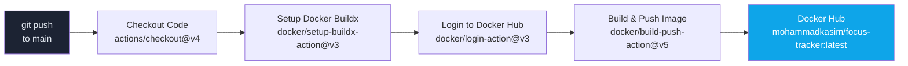
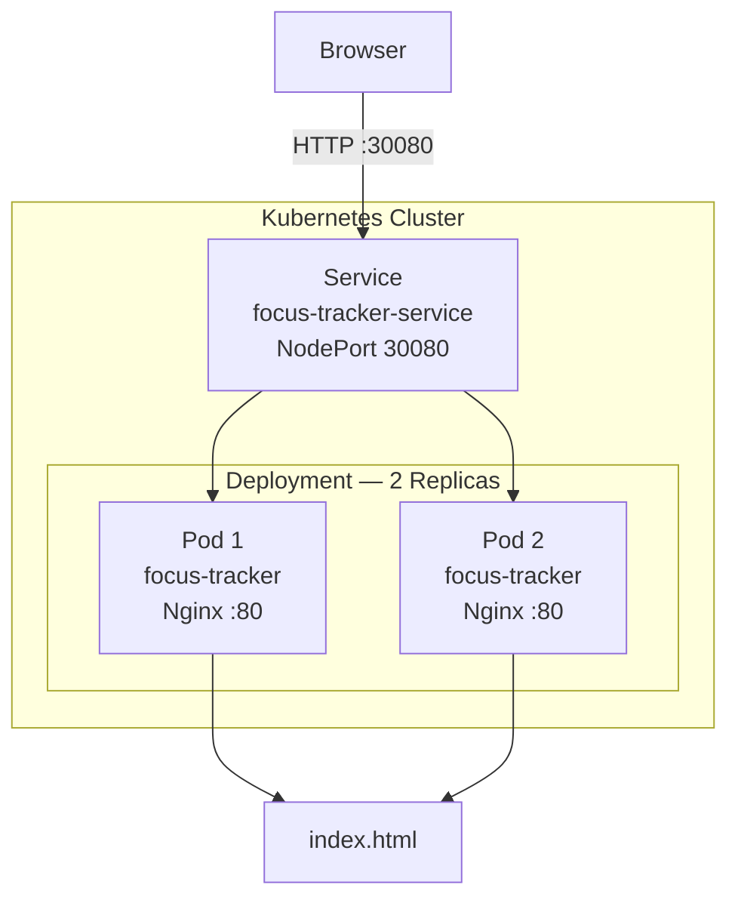
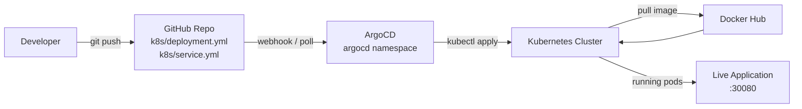

# End-to-End DevOps Implementation on Kubernetes

A complete DevOps workflow showcasing Docker-based containerization, CI/CD pipelines, GitOps deployment using Argo CD, and monitoring integration.

---

## Table of Contents

- [Project Overview](#project-overview)
- [Tech Stack](#tech-stack)
- [Project Structure](#project-structure)
- [How It Works](#how-it-works)
- [Architecture Flowcharts](#architecture-flowcharts)
- [Run Locally](#run-locally)
- [Run with Docker](#run-with-docker)
- [Deploy on Kubernetes](#deploy-on-kubernetes)
- [CI/CD Pipeline](#cicd-pipeline)
- [ArgoCD GitOps Setup](#argocd-gitops-setup)
- [Configuration Reference](#configuration-reference)
- [Troubleshooting](#troubleshooting)

---

## Project Overview

This project is a fully static, single-page portfolio website served by Nginx. It is built with a DevOps-first mindset:

- The site itself is a dark-themed, interactive HTML/CSS/JS page with typing animations, scroll reveals, a live CI/CD pipeline diagram, and a contact form.
- The Docker image uses a **multi-stage build** to keep the final image under ~10 MB.
- Kubernetes manifests deploy **2 replicas** behind a **NodePort service** on port `30080`.
- GitHub Actions automatically **builds and pushes** the Docker image to Docker Hub on every push to `main`.
- **ArgoCD** watches the repository and **auto-syncs** the Kubernetes cluster to match the Git state (GitOps).

---

## Tech Stack

| Layer | Technology |
|---|---|
| Frontend | HTML5, CSS3, Vanilla JavaScript |
| Web Server | Nginx 1.27 Alpine |
| Containerization | Docker (multi-stage build) |
| Orchestration | Kubernetes |
| CI/CD | GitHub Actions |
| GitOps | ArgoCD |
| Registry | Docker Hub |

---

## Project Structure

```
focus-tracker/
├── .github/
│   └── workflows/
│       └── ci.yml          # GitHub Actions CI pipeline
├── k8s/
│   ├── deployment.yml      # Kubernetes Deployment (2 replicas)
│   └── service.yml         # Kubernetes NodePort Service (:30080)
├── .dockerignore           # Files excluded from Docker build context
├── Dockerfile              # Multi-stage Docker build
├── index.html              # Full static site (HTML + CSS + JS)
└── README.md
```

---

## How It Works

### End-to-End Flow

```
Developer pushes code to main
        │
        ▼
GitHub Actions triggers CI pipeline
        │
        ├── Checkout code
        ├── Set up Docker Buildx
        ├── Login to Docker Hub
        └── Build & Push image (mohammadkasim/focus-tracker:latest)
                │
                ▼
        Docker Hub stores the image
                │
                ▼
        ArgoCD detects Git change
                │
                ▼
        ArgoCD syncs Kubernetes cluster
                │
                ▼
        Kubernetes pulls new image
                │
                ├── Pod 1 (focus-tracker) → Nginx → index.html
                └── Pod 2 (focus-tracker) → Nginx → index.html
                        │
                        ▼
                NodePort Service :30080
                        │
                        ▼
                Browser → http://<node-ip>:30080
```

---

## Architecture Flowcharts

### 1. Docker Multi-Stage Build



---

### 2. CI/CD Pipeline — GitHub Actions



---

### 3. Kubernetes Architecture



---

### 4. GitOps Flow — ArgoCD



---

## Run Locally

No Docker or Kubernetes needed — just open the file:

```bash
# Clone the repo
git clone https://github.com/mohammadkasim/focus-tracker.git
cd focus-tracker

# Open directly in browser
start index.html        # Windows
open index.html         # macOS
xdg-open index.html     # Linux
```

---

## Run with Docker

### 1. Build the image

```bash
docker build -t focus-tracker:latest .
```

### 2. Run the container

```bash
docker run --rm -p 8080:80 focus-tracker:latest
```

### 3. Open in browser

```
http://localhost:8080
```

### 4. Check image size

```bash
docker images focus-tracker
# REPOSITORY       TAG       SIZE
# focus-tracker    latest    ~8MB
```

---

## Deploy on Kubernetes

### Prerequisites

- A running Kubernetes cluster (Minikube, Kind, Docker Desktop, or a real cluster)
- `kubectl` configured and pointing to your cluster

### 1. Update the image name

Edit `k8s/deployment.yml` and replace the image with your Docker Hub username if needed:

```yaml
image: mohammadkasim/focus-tracker:latest
```

### 2. Apply the manifests

```bash
kubectl apply -f k8s/deployment.yml
kubectl apply -f k8s/service.yml
```

### 3. Verify pods are running

```bash
kubectl get pods -l app=focus-tracker
# NAME                                        READY   STATUS    RESTARTS
# focus-tracker-deployment-xxxxxxxxx-xxxxx    1/1     Running   0
# focus-tracker-deployment-xxxxxxxxx-xxxxx    1/1     Running   0
```

### 4. Get the NodePort

```bash
kubectl get svc focus-tracker-service
# NAME                     TYPE       CLUSTER-IP    PORT(S)        AGE
# focus-tracker-service    NodePort   10.x.x.x      80:30080/TCP   1m
```

### 5. Access the app

```
http://<node-ip>:30080
```

For Minikube:

```bash
minikube service focus-tracker-service --url
```

---

## CI/CD Pipeline

The pipeline lives in `.github/workflows/ci.yml` and triggers on every push to `main`.

### Pipeline Steps

```
Push to main
    │
    ├─ 1. Checkout Code          (actions/checkout@v4)
    ├─ 2. Set up Docker Buildx   (docker/setup-buildx-action@v3)
    ├─ 3. Login to Docker Hub    (docker/login-action@v3)
    └─ 4. Build & Push Image     (docker/build-push-action@v5)
              ├── context: .
              ├── push: true
              ├── tags: mohammadkasim/focus-tracker:latest
              ├── cache-from: type=gha
              └── cache-to: type=gha,mode=max
```

### Required GitHub Secrets

Go to your repo → **Settings → Secrets and variables → Actions** and add:

| Secret Name | Value |
|---|---|
| `DOCKER_USERNAME` | Your Docker Hub username |
| `DOCKER_TOKEN` | Your Docker Hub access token |

> Generate a Docker Hub token at: https://hub.docker.com/settings/security

---

## ArgoCD GitOps Setup

### 1. Install ArgoCD

```bash
kubectl create namespace argocd

kubectl apply -n argocd -f \
  https://raw.githubusercontent.com/argoproj/argo-cd/stable/manifests/install.yaml \
  --server-side
```

### 2. Wait for pods to be ready

```bash
kubectl get pods -n argocd -w
```

All pods should show `Running` and `1/1` or `2/2`.

### 3. Access the ArgoCD UI

```bash
kubectl port-forward svc/argocd-server -n argocd 9090:443
```

Open: `https://localhost:9090`

### 4. Get the admin password

**PowerShell:**

```powershell
[System.Text.Encoding]::UTF8.GetString(
  [System.Convert]::FromBase64String(
    (kubectl get secret argocd-initial-admin-secret -n argocd -o jsonpath="{.data.password}")
  )
)
```

**Linux / macOS:**

```bash
kubectl get secret argocd-initial-admin-secret -n argocd \
  -o jsonpath="{.data.password}" | base64 --decode
```

Login with:
- Username: `admin`
- Password: decoded value from above

### 5. Create the ArgoCD Application

In the ArgoCD UI:

1. Click **New App**
2. Fill in:

| Field | Value |
|---|---|
| Application Name | `focus-tracker` |
| Project | `default` |
| Sync Policy | `Automatic` |
| Repository URL | `https://github.com/mohammadkasim/focus-tracker` |
| Revision | `main` |
| Path | `k8s` |
| Cluster | `https://kubernetes.default.svc` |
| Namespace | `default` |

3. Click **Create** → ArgoCD will sync and deploy automatically.

From now on, every `git push` to `main` triggers the CI pipeline → pushes a new image → ArgoCD detects the change → re-deploys the pods automatically.

---

## Configuration Reference

| File | Purpose |
|---|---|
| `Dockerfile` | Multi-stage build: node:alpine validates, nginx:alpine serves |
| `.dockerignore` | Excludes node_modules, .git, logs from build context |
| `k8s/deployment.yml` | Runs 2 replicas of the container on port 80 |
| `k8s/service.yml` | Exposes pods via NodePort on port 30080 |
| `.github/workflows/ci.yml` | Builds and pushes Docker image on push to main |

| Variable | Default | Description |
|---|---|---|
| Replicas | `2` | Number of pods in the deployment |
| NodePort | `30080` | External port exposed by the service |
| Container Port | `80` | Port Nginx listens on inside the container |
| Docker Image | `mohammadkasim/focus-tracker:latest` | Image pulled by Kubernetes |

---

## Troubleshooting

**Pods not starting**
```bash
kubectl describe pod -l app=focus-tracker
kubectl logs -l app=focus-tracker
```
Check that the image name in `deployment.yml` exists on Docker Hub.

**NodePort not accessible**
```bash
# Use port-forward as a fallback
kubectl port-forward svc/focus-tracker-service 8080:80
# Then open http://localhost:8080
```

**ArgoCD CRD annotation too large**
```bash
# Use --server-side flag
kubectl apply -n argocd -f <url> --server-side
```

**Port already in use (Windows)**
```cmd
netstat -ano | findstr :8080
taskkill /PID <PID> /F
```

**Docker Hub push fails in CI**
Ensure `DOCKER_USERNAME` and `DOCKER_TOKEN` are set in GitHub repo secrets, not variables.

---

## License

MIT © Mohammad Kasim
